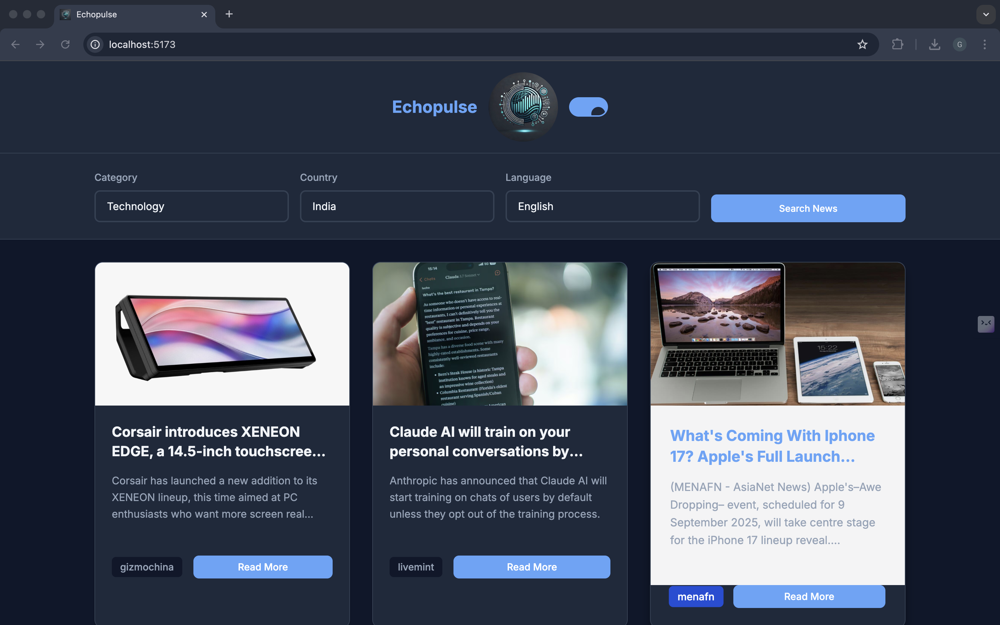
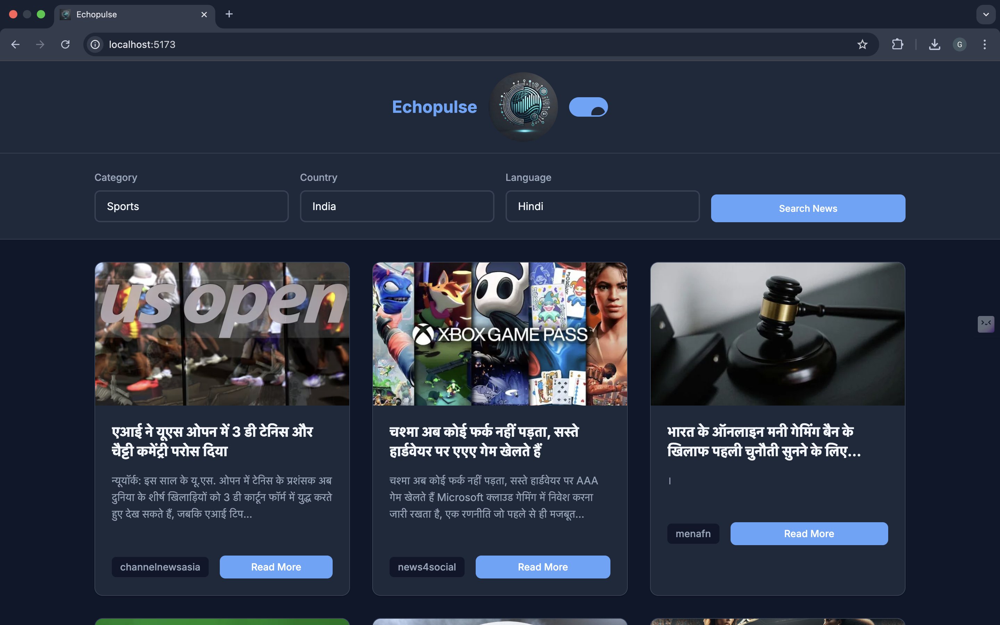
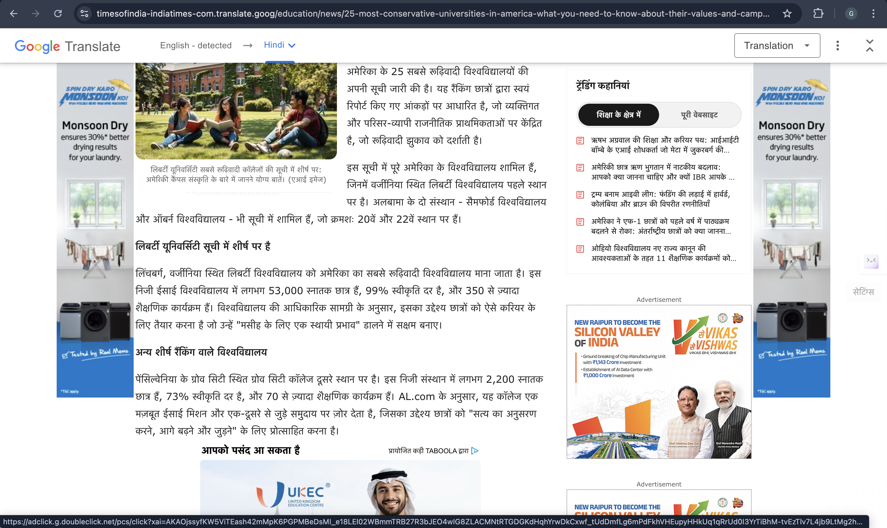

# 🌍 Ecopulse - AI-Powered News Aggregation Platform

Ecopulse is a **web-based AI-powered news aggregation platform** that delivers real-time, personalized news updates by fetching articles from global sources using the **News API**. Unlike traditional platforms, Ecopulse allows users to filter news by **country, category, and language**, and also supports **on-demand translation** via the **Google Translate API**.

---

## ⚙️ How Ecopulse Works

### 1. User Input
- Country (e.g., India, USA, UK)  
- Language (e.g., English, Hindi, French, Arabic, Japanese, etc.)  
- Category (Politics, Technology, Sports, Entertainment, Health, etc.)  

### 2. News Fetching
- Fetches real-time articles using the News API.  
- Standardizes all articles in English first for consistency.  

### 3. Translation
- Utilizes **Google Translate API** to dynamically translate article titles & descriptions.  
- Example: A political article fetched in English can be instantly shown in Hindi or French.  

### 4. AI-Powered Categorization
- Uses AI to organize and optimize articles into categories (Trending, Politics, Tech, Sports, etc.).  

### 5. Display & Exploration
- Articles are displayed in a **scrollable, card-style feed**.  
- Supports **infinite scrolling** for seamless exploration.  
- Users can click to read full articles on the original publisher’s site.  

---

## ✨ Key Features

- ✅ Real-time news fetching via **News API**  
- ✅ AI-based categorization & structuring  
- ✅ Multilingual translation via **Google Translate API**  
- ✅ Filter by **country, language, and category**  
- ✅ Responsive design (desktop & mobile)  
- ✅ Infinite scrolling for smooth news exploration  
- ✅ User-friendly **card-based layout**  

---

## 🚀 Tech Stack
- **Frontend**: HTML, CSS, JavaScript, React  
- **Backend**: Node.js 
- **APIs**: News API, Google Translate API  
- **Other Tools**: Git, GitHub, VS Code  

---

## 📂 Project Structure
```bash
mini-project-/
├── src/              # images
├── css/           # CSS
├── js/           # Js 
├── index.html       # HTML
├── README.md         # Documentation
└── app.js # Main application file
```

## 🛠️ Setup & Installation

### Clone the repository

-- git clone https://github.com/Yezdani01/ecopulse-ai-news.git
-- cd ecopulse-ai-news


### Install dependencies

- npm install


### Run the application

- npm run dev   # for development
- npm start     # for production


### Open in browser

-- http://localhost:3000

## 📸 Screenshots

### 🏠 Homepage 


### 📰 News Feed with Translated content


### 📰 News Feed Translated Source


--- 


## 🤝 Contributing

-- Contributions are welcome! Please fork this repo and submit a pull request for any improvements or bug fixes.

## 📜 License

-- This project is licensed under the MIT License – feel free to use, modify, and distribute.

## 👨‍💻 Author

### Gulam Yezdani Hamza

### GitHub: @Yezdani01

### LinkedIn: https://www.linkedin.com/in/yezdanihamza/
